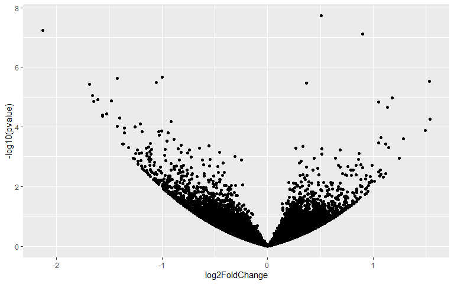
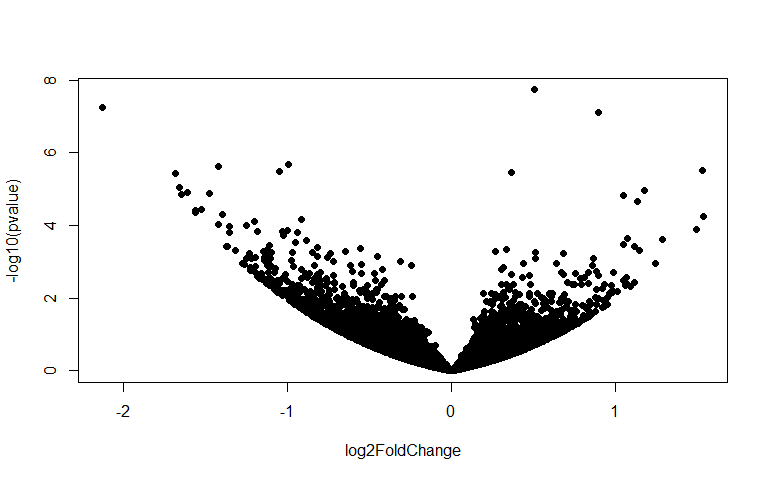
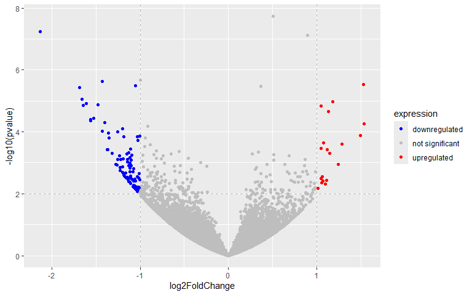
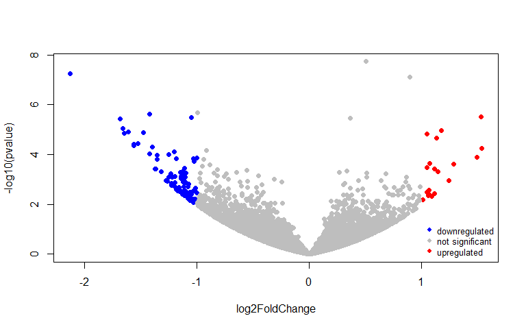
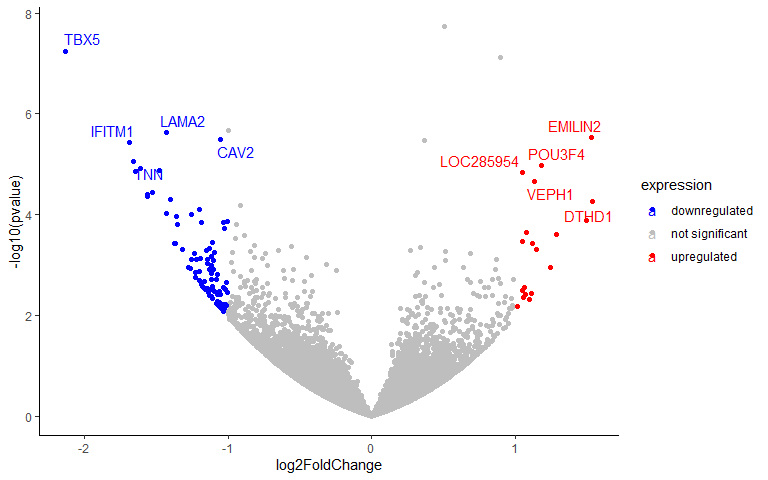
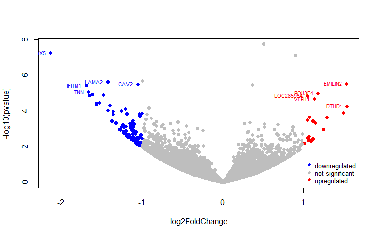
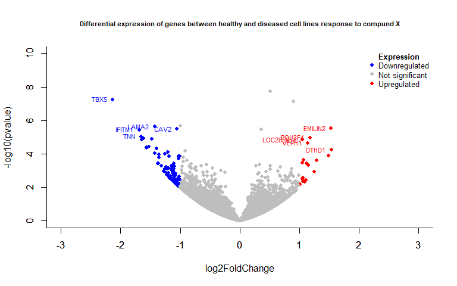

Exploring Differential Gene Expression Data with R
================
Glory Ifeoluwa Jayeoba
08/09/2025

# Background

Gene expression is the process by which information encoded in a gene is
used to direct the synthesis of functional gene products, mostly
protein. This process is highly regulated and plays crucial roles in
cellular activities including cell differentiation, response to external
stimuli etc.

Although all cells in an organism have the same genetic material, they
can control with precision which genes are expressed, when and where
they are expressed, and how much of the gene product is produced. This
regulatory flexibility enables diverse cell types to emerge from the
same genome and allows cells to respond dynamically to their
environment.

Studying gene expression patterns provides valuable insights into cell
functioning and dynamics applicable in biology and medicine. For
instance, we can identify gene associated with diseases, mechanisms of
drug response and resistance, etc.

In this notebook, I will demonstrate a workflow for analyzing
differential gene expression of a healthy and diseased cell line
response to compound X and visualizing the results using a volcano plot.

***This project is part of the HackBio Data science for life science
beginners course and was sponsored by the BioinformHer Initiative.***

# Setting up the notebook output

The setting below ensures that the codes, figures and writings are
displayed in clean and consistent manner in the final output. The codes
suppresses warnings, messages and sets all figures to a consistent size.

``` r
knitr::opts_chunk$set(
  echo = TRUE,
  message = FALSE,
  warning = FALSE,
  fig.width = 8,
  fig.height = 5
)
```

# Setting up the R Environment

To begin analysis, we need to load the required R packages. Each package
serves a specific role in data handling, visualization, or aesthetics
and they include:

- **ggplot2** – a package for creating graphics, often considered a more
  powerful alternative to the base `plot()` function.

- **tidyverse** – a collection of packages (including `dplyr`, `tidyr`,
  `readr`, etc.) designed for data import, cleaning, and manipulation.

- **RColorBrewer** – provides curated color palettes, making plots
  visually appealing.

- **ggrepel** – improves labeling in plots by preventing text from
  overlapping, which is especially useful in crowded plots like volcano
  plots.

``` r
#loading all packages needed in the R environment
library(ggplot2)
library(tidyverse)
library(RColorBrewer)   
library(ggrepel)
```

# Loading Dataset

Once the R environment is set, the next thing to do is to upload your
dataset into your R.

The dataset used in this project is a pre-processed RNAseq data provided
by the HackBio platform. The dataset contain 16406 observations (rows)
and 4 columns namely: Gene symbols, Log2FoldChange, Pvalue, Adjusted
p-values.

The process of importing a file in R is called reading files. Generally,
there ae several functions and packages in R that can be used such as
the `read.table ()`, `read.csv()`, etc. For this project, read_delim
(which is a part of the readr package) will be used.

``` r
#loading the data and assigning it to an object named dataset.
getwd()
```

    ## [1] "C:/Users/HP/OneDrive/Documents/R/bioinformher/new"

``` r
dataset <- read_delim("C:/Users/HP/OneDrive/Documents/dataset_DumpDeseq.txt", 
                      delim = " ", 
                      col_names = TRUE)
dataset
```

    ## # A tibble: 16,406 × 4
    ##    Gene    log2FoldChange       pvalue     padj
    ##    <chr>            <dbl>        <dbl>    <dbl>
    ##  1 DOK6             0.51  0.0000000186 0.000305
    ##  2 TBX5            -2.13  0.0000000566 0.000419
    ##  3 SLC32A1          0.900 0.0000000766 0.000419
    ##  4 IFITM1          -1.69  0.00000374   0.00681 
    ##  5 NUP93            0.366 0.00000337   0.00681 
    ##  6 EMILIN2          1.53  0.00000298   0.00681 
    ##  7 TPX2            -0.997 0.00000210   0.00681 
    ##  8 LAMA2           -1.42  0.00000239   0.00681 
    ##  9 CAV2            -1.05  0.00000321   0.00681 
    ## 10 TNN             -1.66  0.00000897   0.0147  
    ## # ℹ 16,396 more rows

***Note the data was referred to as a tibble which is the same as a
dataframe.***

# Data Cleaning

Depending on the state of your data, you may be required to perform
several clean up. This may include converting data to the appropriate
class, filtering out missing data etc.

The code below filters out missing data in all the columns in the
dataset.

``` r
#checking for missing values in all the columns in the data
dataset <- dataset %>% filter(!is.na(log2FoldChange), 
                              !is.na(pvalue), 
                              !is.na(padj))
dataset
```

    ## # A tibble: 16,406 × 4
    ##    Gene    log2FoldChange       pvalue     padj
    ##    <chr>            <dbl>        <dbl>    <dbl>
    ##  1 DOK6             0.51  0.0000000186 0.000305
    ##  2 TBX5            -2.13  0.0000000566 0.000419
    ##  3 SLC32A1          0.900 0.0000000766 0.000419
    ##  4 IFITM1          -1.69  0.00000374   0.00681 
    ##  5 NUP93            0.366 0.00000337   0.00681 
    ##  6 EMILIN2          1.53  0.00000298   0.00681 
    ##  7 TPX2            -0.997 0.00000210   0.00681 
    ##  8 LAMA2           -1.42  0.00000239   0.00681 
    ##  9 CAV2            -1.05  0.00000321   0.00681 
    ## 10 TNN             -1.66  0.00000897   0.0147  
    ## # ℹ 16,396 more rows

The %\>% is the syntax for pipe. This means the result from the first
function will be used for the next function

After filtering, the number of columns and rows remained the same
implying that there is no missing data in the dataset.

# Analysis

## Creating a Basic volcano Plot

A volcano plot is a common graphics used for visualizing in gene
expression data. This plot enables the magnitude of change
(log2FoldChange) and the statistical significance of the change
(p-value) to be combined in a single figure.

The **x-axis** represents the *log2 fold change* while the **y-axis**
will represents the *–log10(p-value)*.

The negative log10 of the p-values is used because p-values are often
very small (close to zero), by taking their negative log10, it
transforms them into larger positive values. This transformation makes
it much easier to see which genes are most statistically significant, as
they will appear higher on the plot.

In this project, we compare two approaches for generating the volcano
plot:

- **`ggplot2`** which offers greater flexibility and aesthetics.  
- **Base R’s `plot()` function**

``` r
#using ggplot to create the volcano plot
ggplot(data = dataset, aes(x = log2FoldChange, y = -log10(pvalue))) + 
  geom_point() 
```

<!-- -->

``` r
#using the plot()function to create the volcano plot
plot(dataset$log2FoldChange, -log10(dataset$pvalue),    
     xlab = "log2FoldChange",       
     ylab = "-log10(pvalue)",                                    
     col = "black",               
     pch = 19)                  
```

<!-- -->

## Identifying Differentially Expressed Genes

Once we have visualized the volcano plot, we can also it in relation to
biological significance.

Recall that the log2FoldChange values represents the difference in gene
expression between healthy and diseased states. A value of 0 indicates
no difference in expression. A positive value indicates up-regulation
(higher expression in diseased compared to healthy). Finally, a negative
value indicates down-regulation (lower expression in diseased compared
to healthy).

Similarly, the p-values represents the statistical significance and the
higher the p-values the more statistical signifcant the difference
between the two health status.

By applying a threshold, we can classify genes into three categories:

- ***Up-regulated genes***

- ***Down-regulated genes***

- ***Genes with no significant difference***

This step is crucial because it helps narrow down the list of genes to
those most likely to play a role in cell’s response to compound X.

``` r
##Setting threshold
## Up-regulated gene = Log2FoldChange > 1 and pvalue < 0.01
## Down-regulated gene = Log2FoldChange < -1 and pvalue < 0.01

#using ggplot package
ggplot(data = dataset, aes(x = log2FoldChange, y = -log10(pvalue))) + 
  geom_vline(xintercept = c(-1, 1), 
             col = "gray", 
             linetype = "dashed") + 
  geom_hline(yintercept = -log10(0.01),
             col = "gray", 
             linetype = "dashed") + 
  geom_point()
```

<!-- -->

``` r
#using the plot() function
plot(dataset$log2FoldChange, -log10(dataset$pvalue),
     xlab = "log2FoldChange",
     ylab = "-log10(pvalue)",
     col = "black",
     pch = 19,
     bg = "black")
abline(h = -log10(0.01), 
       col = "gray", 
       lty = 2)   
abline(v = c(-1, 1), 
       col = "gray", 
       lty = 2) 
```

<!-- -->
\## Colour coding differntially expressed genes

In the volcano plot, the vertical line separates down-regulated and
up-regulated genes (right side). Similarly, the horizontal line at the
p-value of 0.01 (-log10 = 2) threshold separates non-significant genes
(below the line) from significant ones (above the line).

To make the visually more informative, we can color the points to
distinguish between the 3 categories

***Up-regulated genes = red***

***Down-regulated genes = blue***

***Non-significant genes = grey***

To achieve this, we will create a new column named expression in our
dataset and set all values in this column to “NO”. Genes will then be
re-labeled as “UP” or “DOWN” depending on the thresholds. This will
allow us to color-code genes in the volcano plot.

``` r
##creating a new column that categorize each gene.
dataset$expression <- "NO"          #setting all values in the new column to NO

#setting values within this threshold to UP
dataset$expression[dataset$log2FoldChange >1 & dataset$pvalue < 0.01] <- "UP" 

#setting values within this threshold to DOWN
dataset$expression[dataset$log2FoldChange < -1 & dataset$pvalue < 0.01] <- "DOWN" 

#using ggplot package
ggplot(data = dataset, 
       aes(x = log2FoldChange, y = -log10(pvalue), col = expression)) + 
  geom_vline(xintercept = c(-1, 1),
             col = "gray", 
             linetype = "dashed") + 
  geom_hline(yintercept = -log10(0.01), 
             col = "gray", 
             linetype = "dashed") + 
  geom_point() +
  
  #setting the colors, blue(down), grey(no), red(up)
  scale_color_manual(values = c("blue", "grey", "red"),                  
                     labels = c("downregulated", "not significant",
                                "upregulated"))
```

<!-- -->

``` r
##Using the plot() function
#assign colors based on expression values (similar to scale_color_manual)
colour <- c("DOWN" = "blue", "NO" = "gray", "UP" = "red")

plot(dataset$log2FoldChange, -log10(dataset$pvalue),
     xlab = "log2FoldChange",
     ylab = "-log10(pvalue)", 
     bg = "gray",
     pch = 19,
     col = colour[dataset$expression])  
#adding legend to the plot
legend("bottomright", 
       legend = c("downregulated", "not significant", "upregulated"),   
       levels(as.factor(dataset$expression)), 
       col = colour,
       pch = 19,
       cex = 0.8,
       bty = "n")
```

<!-- -->

## Adding gene labels

So far, we have created a basic volcano plot, identified differentially
expressed genes, and color-coded them based on their regulation status.
The next step is to label the genes directly on the plot.

While labeling all significant genes might seem useful, in practice it
leads to a cluttered and unreadable plot due to the large number of
overlapping text labels. To avoid this, it is best to highlight only the
most significant genes (for example, the top 5 up-regulated and top 5
down-regulated).

To achieve this, we will create a new column in our dataset named
topgenes that contains the gene name of only the top 5 up-regulated
genes and the top 5 down regulated genes. For all other genes, the value
will be set to NA.

``` r
#Selecting the top 5 up-regulated gene
top_up <- dataset %>% 
  filter(log2FoldChange > 1) %>%
  arrange(pvalue) %>%
  slice_head(n = 5) %>%
  pull(Gene)

#this means: For values in dataset, filter those with log2FoldChange > 1, 
#arrange the result based on their pvalues (lowest to highest), 
#extract the top 5 rows, and extract all the values in the Gene column

#Selecting the top 5 down-regulated gene (similar to top_up)
top_down <- dataset %>%
  filter(log2FoldChange < -1) %>%
  arrange(pvalue) %>%
  slice_head(n = 5) %>%
  pull(Gene)

#Setting all other gene aside the top up and down regulated genes to NA
dataset$topgenes <- ifelse(dataset$Gene %in% c(top_up, top_down),
                           dataset$Gene, NA)

#plotting with the top 5 gene labeled
#Using ggplot package
ggplot(data = dataset, 
       aes(x = log2FoldChange, y = -log10(pvalue), col = expression)) + 
  geom_point() +
  scale_color_manual(values = c("blue", "grey", "red"), 
                     labels = c("downregulated", "not significant",
                                "upregulated")) +
  geom_text_repel(aes(label = topgenes), max.overlaps = 15) + 
  theme_minimal() +
  theme_classic()
```

<!-- -->

``` r
#Using plot () function
colour <- c("DOWN" = "blue", "NO" = "gray", "UP" = "red")
plot(dataset$log2FoldChange, -log10(dataset$pvalue),
     xlab = "log2FoldChange",
     ylab = "-log10(pvalue)", 
     bg = "gray",
     pch = 19,
     col = colour[dataset$expression])
legend("bottomright", 
       legend = c("downregulated", "not significant", "upregulated"),
       levels(as.factor(dataset$expression)), 
       col = colour,
       pch = 19,
       cex = 0.8,
       bty = "n")
topdata <- subset(dataset, !is.na(topgenes))
with(topdata, text(
  log2FoldChange, -log10(pvalue), 
  labels = topgenes,
  col = ifelse(log2FoldChange > 0, "red", "blue"),
  cex = 0.7,
  pos = ifelse(log2FoldChange > 0, 2, 2)
))
```

<!-- -->

Finally, we enhance the volcano plot by adding additional features such
as a clear title, axis labels, and rescaling to improve readability.
These adjustments make the plot appear more polished and professional.

``` r
#for plot using ggplot package
ggplot(data = dataset, 
       aes(x = log2FoldChange, y = -log10(pvalue), col = expression)) + 
  geom_point() +
  scale_color_manual(values = c("blue", "grey", "red"), 
                     labels = c("downregulated", "not significant",
                                "upregulated")) +
  geom_text_repel(aes(label = topgenes), max.overlaps = 15) + 
  theme_minimal() +
  theme_classic() +
  scale_x_continuous(limits = c(-3, 2), breaks = seq(-3,2,1)) +
  scale_y_continuous(limits = c(0, 10), breaks = seq(0,10,5)) +
  ggtitle("Differential expression of genes between healthy and diseased cell lines response to compund X") +
  theme(plot.title = element_text(hjust = 0.5, size = 9, face = "bold"),
        plot.title.position = "panel")
```

<!-- -->

``` r
#For plot using plot () function
par(bty = "l")
colour <- c("DOWN" = "blue", "NO" = "gray", "UP" = "red")
plot(dataset$log2FoldChange, -log10(dataset$pvalue),
     xlab = "log2FoldChange",
     ylab = "-log10(pvalue)", 
     xlim = c(-3, 3),
     ylim = c(0, 10),
     bg = "gray",
     pch = 19,
     cex = 0.8,
     title(main = "Differential expression of genes between healthy and diseased cell lines response to compund X",
           cex.main = 0.7,
           adj = 0.5),
     col = colour[dataset$expression])
legend("topright", 
       legend = c("Expression", "Downregulated", "Not significant", "Upregulated"),
       levels(as.factor(dataset$expression)), 
       col = c(NA, colour),
       pch = c(NA, 19, 19, 19),
       cex = 0.8,
       bty = "n",
       text.font = c(2,1,1,1))
axis(1, at = seq(-3, 3, 1))
axis(2, at = seq(0, 10, 2))
topdata <- subset(dataset, !is.na(topgenes))
with(topdata, text(
  log2FoldChange, -log10(pvalue), 
  labels = topgenes,
  col = ifelse(log2FoldChange > 0, "red", "blue"),
  cex = 0.7,
  pos = ifelse(log2FoldChange > 0, 2, 2)
))
```

<!-- -->

# Functions of top genes

### Top 5 Up-regulated genes

**EMILIN2**: stands for Elastin Microfibril Interfacer 2. It is located
in extracellular region and is predicted to enable extracellular matrix
constituent conferring elasticity. it is involved in several processes
including positive regulation of angiogenesis, defense response to
bacterium, and platelet aggregation.

**POU3F4**: encodes a member of the POU-III class of neural
transcription factors and plays a role in inner ear development. The
protein is thought to be involved in the mediation of epigenetic signals
which induce striatal neuron-precursor differentiation. Mutations in
this gene are associated with X chromosome-linked nonsyndromic mixed
deafness.

**LOC285954**: located in the HOXA cluster on the human chromosome 7 and
is involved in transcriptional regulation.

**VEPH1**: stands for Ventricular Zone Expressed PH Domain Containing 1.
It is predicted to enable phosphatidylinositol-5-phosphate binding
activity. It is Involved in negative regulation of SMAD protein signal
transduction and negative regulation of transforming growth factor beta
receptor signaling pathway

**DTHD1**: stands for Death Domain Containing 1. Death domain-containing
proteins function in signaling pathways and formation of signaling
complexes, as well as the apoptosis pathway.

### Top 5 Down-regulated genes

**TBX5**: stands for T-box Transcription Factor 5. The encoded protein
may play a role in heart development and specification of limb identity.
Mutations in this gene have been associated with Holt-Oram syndrome, a
developmental disorder affecting the heart and upper limbs.

**LAMA2**: stands for Laminin Subunit Alpha 2. It is thought to mediate
the attachment, migration, and organization of cells into tissues during
embryonic development by interacting with other extracellular matrix
components. Mutations in this gene have been identified as the cause of
congenital merosin-deficient muscular dystrophy.

**CAV2**: stands for Caveolin 2. The protein encoded by this gene is a
major component of the inner surface of caveolae, small invaginations of
the plasma membrane, and is involved in essential cellular functions,
including signal transduction, lipid metabolism, cellular growth control
and apoptosis. This protein may function as a tumor suppressor.

**IFITM1**: stands for Interferon-induced transmembrane (IFITM) and a
member of the interferon induced antiviral protein family. It is
involved in the restriction of cellular entry by diverse viral
pathogens, such as influenza A virus, Ebola virus and Sars-CoV-2.

**TNN**: stands for Tenascin N. It is predicted to enable integrin
binding activity. It is involved in the regulation of cell adhesion,
migration and the positive regulation of sprouting angiogenesis.
